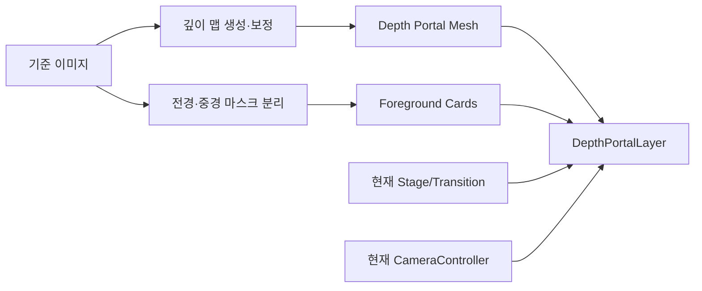

# 3단계 2.5D Depth Shader 적용 설계

## 1. 결론

현재 3장의 이미지는 시점 차이가 거의 없어 스테레오 복원이나 완전한 3D 재구성에는 적합하지 않다. 대신 한 장의 기준 이미지에서 단안 깊이 맵을 생성하고, 전경 오브젝트를 별도 카드로 분리하는 **하이브리드 2.5D 포털** 방식은 적용 가능하다.

- 권장 방식: 깊이 변형 메시 1개 + 전경/중경 카드 2~4개
- 적용 위치: 3단계(`observation`) 진입 시 선택된 포커스 공간
- 최초 적용 대상: 세로 화면비와 현재 포커스 방향이 맞는 `signal-05`
- 안전한 시점 범위: 좌우 회전 약 ±5~8도, 화면 폭 기준 이동 약 5~10%
- 비권장: 세 이미지를 멀티뷰 입력처럼 사용한 NeRF/가우시안 스플래팅, 무제한 자유 시점

이 방식의 목표는 사진을 완전한 3D 공간으로 만드는 것이 아니라, 관객이 실제 공간 안쪽을 살짝 들여다보는 듯한 깊이와 시차를 만드는 것이다.

## 2. 입력 이미지 판단

입력 이미지는 모두 어두운 실내, 전경의 주황색 안전망과 지지대, 중경의 벽과 개구부, 후경의 파란 방수포와 밝은 외부로 구성되어 있다.

세 이미지 사이에는 그림자와 크롭의 미세한 차이만 있고 카메라 베이스라인이 거의 없다. 따라서 다음처럼 사용한다.

- `00.20.30`: 해상도가 가장 큰 기준 컬러 이미지 후보
- 나머지 2장: 깊이 생성용 멀티뷰가 아니라 경계 확인, 노이즈 판단, 누락 영역 보조 자료
- 자동 생성 깊이 맵: 초안으로만 사용
- 안전망, 세로 지지대, 방수포 경계: 수동 마스크 보정 필수

## 3. 런타임 구조



### 제안 파일 구조

```text
src/
  scene/
    depth-portal/
      DepthPortalLayer.tsx
      DepthPortalMaterial.ts
      depthPortalConfig.ts
public/
  assets/
    depth-portal/
      construction-space/
        color.webp
        depth.png
        foreground-mask.png
        midground-mask.png
        fallback.webp
```

`DepthPortalLayer`는 기존 `ObservationLayer`와 같은 좌표계 아래에 두되, 기존 방과 소품의 투명도 처리 및 포커스 애니메이션과 독립적으로 동작시킨다. 사진 기반 공간이 기존 벽면과 겹치지 않도록 포털 전체를 하나의 `Group`으로 묶고 위치·크기·깊이 스케일을 설정값으로 관리한다.

### 신호 설정 확장

`ObservationSignalConfig`에 선택적인 포털 설정을 추가한다.

```ts
interface DepthPortalConfig {
  assetId: string
  position: [number, number, number]
  rotation: [number, number, number]
  size: [number, number]
  depthScale: number
  maxParallax: number
}
```

초기에는 `signal-05`에만 `depthPortal`을 지정한다. 다른 신호는 현재 절차형 소품을 유지하므로, 포털 에셋 로드 실패가 전체 3단계 체험을 막지 않는다.

## 4. 에셋 전처리 설계

### 4.1 기준 프레임 정리

1. 세 이미지의 공통 시야를 기준으로 크롭과 원근을 정렬한다.
2. 암부 노이즈를 줄이되 안전망의 반복 패턴은 뭉개지지 않게 처리한다.
3. 밝은 출입구와 어두운 벽 사이의 노출 차이를 완화한다.
4. 런타임 컬러 이미지는 세로 비율을 유지하고 장변 1600~1800px WebP로 출력한다.

### 4.2 깊이 맵

단안 깊이 추정 결과를 다음 깊이 구간으로 재매핑한다.

| 구간 | 주요 대상 | 상대 깊이 |
|---|---|---:|
| 전경 | 주황색 안전망, 목재/금속 지지대 | 0.05~0.25 |
| 중경 | 바닥, 벽, 출입구 프레임 | 0.30~0.60 |
| 후경 | 파란 방수포와 주변 설비 | 0.65~0.85 |
| 최후경 | 방수포 뒤 밝은 외부 | 0.90~1.00 |

오프라인 원본은 16비트 깊이로 보관한다. 브라우저 런타임에서는 호환성과 용량을 우선해 보정된 8비트 단일 채널 PNG를 기본으로 사용한다. 밴딩이 보일 경우에만 Half Float/EXR 경로를 별도 검토한다.

### 4.3 레이어 분리

단일 메시만 사용하면 전경 경계에서 배경 픽셀이 늘어나므로 최소 다음 레이어를 분리한다.

1. 전경 카드: 주황색 안전망과 화면 좌측/중앙 지지대
2. 본체 메시: 벽, 바닥, 출입구
3. 중경 카드: 파란 방수포와 걸린 설비
4. 선택 카드: 방수포 뒤의 밝은 외부

분리 후 드러날 빈 영역은 생성형 확장 또는 수동 인페인팅으로 원본 경계보다 8~12% 넓게 확보한다. 이 패딩이 없으면 작은 카메라 이동에서도 검은 틈이 발생한다.

## 5. 메시와 셰이더

### 5.1 본체 메시

- 세로형 분할 평면: 약 `128 x 224` 세그먼트부터 시작
- 버텍스 셰이더에서 깊이 텍스처를 샘플링해 Z 방향 변형
- 최대 버텍스 수는 약 3만 개 수준으로 제한
- 포털 자체에는 장면 조명을 다시 적용하지 않고 사진에 구워진 조명을 유지

개념식:

```glsl
float depth = texture2D(uDepthMap, uv).r;
float shapedDepth = pow(depth, uDepthGamma);
position.z += (1.0 - shapedDepth) * uDepthScale * uReveal;
```

깊이 방향은 실제 출력 맵의 흑백 정의에 따라 한 번만 통일한다. 셰이더 안에서 조건 분기를 두지 않고 전처리 결과를 규격화한다.

### 5.2 시차

카메라의 포털 로컬 좌표를 기준으로 UV를 매우 작게 이동한다. 복수 샘플을 반복하는 무거운 Parallax Occlusion Mapping은 사용하지 않는다.

- `uParallaxStrength`: 0~1 범위
- `uMaxUvOffset`: 화면 폭의 약 0.025~0.05
- 깊이 경계에서는 마스크 기반 페이드 적용
- 포털 외곽은 소프트 마스크와 비네팅으로 잘린 가장자리를 숨김

카메라가 안전 범위를 벗어나면 추가 시차를 주지 않고 오프셋을 고정한다. 이는 왜곡을 완전히 없애지는 못하지만 급격한 찢어짐을 방지한다.

### 5.3 투명도와 렌더 순서

현재 실내 재질 다수가 `transparent: true`, `depthWrite: false`를 사용하므로 포털과의 정렬 충돌 가능성이 높다. 다음 규칙을 고정한다.

- 본체 메시: 가능하면 불투명 재질, `depthWrite: true`
- 전경 카드: 투명 재질, `alphaTest` 우선, 필요한 경우만 블렌딩
- 렌더 순서: 본체 → 중경 카드 → 전경 카드 → UI성 효과
- 기존 뒤쪽 벽과 물리적으로 간격 확보하여 Z-fighting 방지

안전망처럼 구멍이 많은 텍스처는 일반 알파 블렌딩보다 `alphaTest`가 정렬과 성능에 유리하다. 가장자리 품질이 부족할 때만 디더링을 추가한다.

## 6. 단계 전환 연동

현재 `CameraController`가 `camera.userData.transitionProgress`를 기록하고, `ObservationLayer`가 이를 읽어 내부 노출도를 계산한다. 포털도 같은 전환 진행률을 읽되 독립된 곡선을 사용한다.

| 상태 | 포털 동작 |
|---|---|
| 1단계 `hub` | 렌더하지 않음, 필요 시 저우선순위 프리로드 |
| 1→2단계 | 선택 신호가 포털 대상이면 컬러·깊이·마스크 프리로드 |
| 2단계 `approach` | 기존 내부만 보이고 포털은 아직 숨김 |
| 2→3단계 | 진행률 0.35부터 페이드/깊이 변형 시작, 0.65부터 시차 증가 |
| 3단계 `observation` | 완전 노출, 제한된 카메라 시차와 자동 재생 연동 |
| 허브 복귀 | 깊이와 시차를 함께 감소시키고 텍스처는 캐시 유지 |

권장 곡선:

```ts
reveal = smoothstep(0.35, 1.0, transitionProgress)
parallax = smoothstep(0.65, 1.0, transitionProgress)
```

포털이 준비되지 않았을 때 카메라 전환을 멈추지 않는다. 대신 `fallback.webp`를 평면으로 먼저 표시하고, 깊이 텍스처가 준비되면 다음 진입부터 셰이더를 활성화한다. 첫 진입 도중 평면이 갑자기 입체로 튀는 전환은 허용하지 않는다.

### 카메라 경로 제약

현재 3단계 카메라는 신호별 `observationOffset`까지 이동하며 FOV가 `25.5`로 좁아진다. 포털 대상 신호에서는 다음을 별도 보정한다.

- 포털 중심을 향하는 전용 `observationOffset` 사용
- 전환 종료 시 사진의 소실점과 카메라 타깃 정렬
- 전환 중 측면 편차를 포털 폭 기준 5~10% 이내로 제한
- 3단계 터치 탐색도 전체 오빗 대신 작은 카메라 패럴랙스만 허용

## 7. 자동 재생 및 인터랙션

3단계 도착 후 기존 자동 재생과 포털의 노출을 다음 순서로 맞춘다.

1. 카메라 전환 완료
2. 포털 완전 노출 확인
3. 0.3~0.5초 안정 구간
4. 기존 자동 재생 시작
5. 자동 재생 종료 후 터치 탐색 활성화

터치 좌표는 사진의 UV가 아니라 포털 로컬 평면과 레이캐스트한 뒤 정의된 핫스폿으로 매핑한다. 깊이 변형 메시 표면에 직접 다수의 클릭 영역을 심지 않고, 보이지 않는 단순 평면을 입력 표면으로 둔다.

## 8. 성능 예산

초기 목표는 현재 Canvas의 최대 DPR `1.5`를 유지하면서 모바일에서도 안정적으로 동작하는 것이다.

| 항목 | 목표 |
|---|---:|
| 컬러 + 깊이 + 마스크 다운로드 | 합계 4MB 이하 |
| GPU 텍스처 메모리 | 약 10~16MB 이내 |
| 메시 정점 | 3만~5만 이하 |
| 본체 셰이더 샘플 | 컬러 1 + 깊이 1 + 선택 마스크 1 |
| 추가 포스트프로세싱 | 없음 |
| 데스크톱 목표 | 60fps |
| 저사양 모바일 허용 하한 | 30fps |

`prefers-reduced-motion`, 저사양 GPU, 텍스처 로드 실패에서는 시차와 버텍스 변형을 끄고 `fallback.webp` 평면만 표시한다.

## 9. 예상 문제점과 대응

### P0 — 구현 전에 반드시 해결

| 문제 | 영향 | 대응 |
|---|---|---|
| 세 이미지의 시점 차이가 거의 없음 | 실제 가려진 면을 복원할 수 없음 | 한 장 기반 2.5D로 범위를 명확히 제한하고 카메라 이동을 클램프 |
| 안전망과 지지대의 깊이 경계 오류 | 카메라 이동 시 찢어짐, 배경 번짐 | 전경 카드 분리, 수동 마스크, 인페인팅 패딩 |
| 방수포의 주름과 반투명 그림자 | 단안 깊이 모델이 물체 깊이와 명암을 혼동 | 방수포 깊이를 완만한 단일 면으로 재보정하고 주름은 컬러 디테일로 유지 |
| 암부와 밝은 출입구의 큰 노출 차이 | 깊이 밴딩, 색 번짐, 압축 노이즈 | 톤 보정 후 깊이 생성, 에지 구간 별도 마스크 |
| 세로 사진과 가로형 씬의 비율 차이 | 과도한 크롭 또는 작은 포털 | 3단계 전용 세로형 공간/프레임으로 연출하고 배경색으로 좌우 여백 흡수 |
| 현재 카메라 이동 폭이 안전 범위를 넘을 수 있음 | 2.5D 한계가 즉시 노출 | `signal-05` 전용 종점과 베지어 제어점 설정, 회전 ±5~8도 이내 검증 |

### P1 — 통합 단계에서 해결

| 문제 | 영향 | 대응 |
|---|---|---|
| 기존 투명 실내 재질과 포털 정렬 충돌 | 오브젝트가 앞뒤로 깜박임 | 본체 `depthWrite`, 카드 `alphaTest`, 고정 `renderOrder` 적용 |
| 벽면 액자/뒤벽과 동일 평면 | Z-fighting | 포털 전용 깊이 간격 확보 또는 대상 신호의 기존 액자 숨김 |
| 컬러만 먼저 로드되고 깊이가 늦게 로드됨 | 진입 중 입체가 갑자기 튐 | 첫 진입 상태를 평면/깊이 중 하나로 고정, 다음 진입부터 승격 |
| 깊이 PNG 정밀도와 브라우저 차이 | 계단형 깊이, 기기별 모양 차이 | 8비트 보정 범위를 먼저 최적화하고 필요할 때만 Half Float 경로 추가 |
| 좁은 FOV에서 작은 카메라 이동도 크게 보임 | 멀미와 왜곡 증가 | 시차 값을 화면 UV 기준으로 제한하고 감속 곡선 적용 |
| 사진의 고정 조명과 현재 3D 조명 불일치 | 합성 티가 남 | 포털에는 장면 조명 미적용, 주변에 어두운 프레임/안개로 경계 연결 |

### P2 — 품질 및 운영 이슈

| 문제 | 영향 | 대응 |
|---|---|---|
| 세 이미지를 교차 재생할 경우 그림자 위치가 달라짐 | 미세한 플리커 | 기본은 한 장만 사용, 영상적 변화는 별도 컬러 그레이딩/노이즈로 생성 |
| 저사양 iOS의 텍스처 메모리 압박 | 프레임 저하 또는 WebGL 컨텍스트 손실 | 1024px 대체 에셋, DPR 1.0 폴백, 사용하지 않는 텍스처 지연 로드 |
| 과도한 패럴랙스의 멀미 | 관객 피로 | reduced-motion 대응, 터치 이동 감도 제한 |
| 원본 PNG를 그대로 배포 | 초기 로딩 증가 | 런타임 WebP/압축 깊이 맵 별도 생성, 원본은 제작용으로 분리 |

## 10. 구현 단계와 검증 기준

### 1단계 — 에셋 프로토타입

- 기준 이미지 1장 선정
- 자동 깊이 맵 생성
- 전경/방수포 수동 마스크 작성
- 카메라 ±5도 테스트 영상 생성

통과 기준: 안전망, 지지대, 방수포 경계에 검은 틈이나 큰 늘어짐이 없어야 한다.

### 2단계 — 셰이더 단독 검증

- 깊이 변형 메시와 카드 레이어 구현
- 시차 상한, 깊이 스케일, 가장자리 페이드 조정
- 평면 폴백 구현

통과 기준: 데스크톱 60fps, 모바일 30fps 이상이며 셰이더 컴파일 오류가 없어야 한다.

### 3단계 — 3단계 씬 통합

- `signal-05` 설정 연결
- 2→3단계 reveal/parallax 곡선 연결
- 기존 액자 그룹과 렌더 순서 조정
- 자동 재생 시작 시점 연결

통과 기준: 진입 중 깜박임이나 입체 팝이 없고, 허브 복귀 후 다시 진입해도 상태가 초기화되어야 한다.

### 4단계 — 기기 검증

- Chrome/Safari 데스크톱
- iOS Safari
- Android Chrome
- reduced-motion 및 느린 네트워크

통과 기준: 로드 실패 시에도 기존 3단계가 사용 가능하고, WebGL 컨텍스트 손실 없이 반복 진입할 수 있어야 한다.

### 5단계 — 연출 보정

- 포털 프레임과 주변 안개/암부 연결
- 자동 재생 후 핫스폿 배치
- 일본어 안내 문구 및 접근성 검증

## 11. 최종 권고

이 입력에는 **순수 단일 평면 Depth Shader보다 하이브리드 레이어 방식이 필수**다. 특히 안전망과 세로 지지대를 분리하지 않으면 구현은 빠르더라도 3단계 카메라 이동에서 품질 문제가 바로 드러난다.

따라서 첫 구현은 `signal-05` 한 곳에 제한하고, 에셋 프로토타입에서 카메라 안전 범위를 먼저 확정한 뒤 씬에 통합한다. 프로토타입이 기준을 통과하지 못하면 카메라 이동 폭을 줄이거나, 깊이 변형 없이 다층 카드 연출로 폴백하는 것이 적절하다.

## 12. 구체적인 단계별 구현 방법

아래 순서는 각 단계가 통과해야 다음 단계로 넘어가는 것을 전제로 한다. 실패한 실험 파일은 다음 단계에 섞지 않고, 직전 통과 상태를 유지한다.

### 단계 0 — 현재 동작 기준선 고정

**목적:** Depth Portal을 추가한 뒤 기존 기능이 깨졌는지 판단할 기준을 만든다.

**작업**

1. 현재 작업 트리에서 사용자 소유 변경과 구현 대상 파일을 구분한다.
2. `npm run typecheck`와 `npm run build`를 실행한다.
3. 다음 장면의 기준 스크린샷과 콘솔 상태를 기록한다.
   - 허브
   - `signal-05` 2단계
   - `signal-05` 2→3단계 중간
   - 3단계 도착
   - 허브 복귀
4. 데스크톱에서 평균 FPS, draw call, texture memory의 대략적인 기준값을 기록한다.

**변경 파일:** 없음

**통과 기준**

- 타입 검사와 프로덕션 빌드 성공
- 기존 5개 신호 진입과 허브 복귀 가능
- 기준 상태에 콘솔 오류 없음

**커밋 지점:** 코드 변경이 없으므로 커밋하지 않음

---

### 단계 1 — 제작용 에셋과 런타임 에셋 확정

**목적:** 셰이더 구현 전에 컬러·깊이·마스크의 규격을 고정한다.

**제작용 폴더 제안**

```text
artwork/depth-portal/construction-space/
  source/
    reference-01.png
    reference-02.png
    reference-03.png
  working/
    depth-master-16bit.png
    foreground-master.psd
    inpainted-background.png
  preview/
    parallax-left.png
    parallax-center.png
    parallax-right.png
```

**런타임 출력**

```text
public/assets/depth-portal/construction-space/
  color.webp
  depth.png
  foreground-color.webp
  foreground-mask.png
  midground-color.webp
  midground-mask.png
  fallback.webp
```

**작업 순서**

1. 세 번째 이미지를 기준 프레임 후보로 삼고 나머지 두 장과 공통 크롭을 맞춘다.
2. 단안 깊이 추정으로 16비트 초안 깊이 맵을 만든다.
3. 깊이를 전경·중경·후경 4구간으로 다시 매핑한다.
4. 안전망과 지지대를 전경 알파로 분리한다.
5. 파란 방수포와 걸린 설비를 중경 알파로 분리한다.
6. 전경이 이동했을 때 드러나는 벽과 바닥을 인페인팅한다.
7. 좌·중앙·우 3개 가상 시점 이미지를 출력해 경계를 육안 검수한다.
8. 통과 후 런타임 에셋을 장변 1600~1800px로 출력한다.

**Git 관리**

- PSD, EXR, 16비트 제작 원본은 Git LFS 대상
- 최적화된 런타임 WebP/PNG는 합계 4MB 이하라면 일반 Git 대상
- 기존 `references/` 파일은 직접 이동하거나 덮어쓰지 않고 복사본을 제작 입력으로 사용

**통과 기준**

- 좌우 가상 이동에서 안전망 주변에 검은 구멍이 없음
- 지지대 가장자리의 늘어짐이 4px 내외를 넘지 않음
- 방수포가 벽보다 앞으로 튀거나 주름 단위로 갈라지지 않음
- 런타임 에셋 합계 4MB 이하

**실패 시 조정 순서**

1. 마스크 경계 확장과 인페인팅 범위 증가
2. 깊이 스케일 감소
3. 카메라 허용 범위 감소
4. 본체 변형을 제거하고 다층 카드 방식으로 전환

**권장 커밋:** `assets: add construction depth portal sources and runtime maps`

---

### 단계 2 — 포털 설정 타입과 대상 신호 연결

**목적:** JSX에 좌표와 에셋 경로를 흩어놓지 않고 신호별 설정으로 관리한다.

**신규 파일**

- `src/scene/depth-portal/depthPortalConfig.ts`

**수정 파일**

- `src/signals/signalData.ts`

**구현 내용**

1. `DepthPortalConfig` 타입을 정의한다.
2. 포털 크기, 위치, 회전, 깊이 강도, 최대 UV 이동량을 한 객체에 둔다.
3. `ObservationSignalConfig`에 `depthPortal?: DepthPortalConfig`를 추가한다.
4. `signal-05`에만 `construction-space` 설정을 연결한다.
5. `getDepthPortalConfig(signalId)`와 `hasDepthPortal(signalId)` 헬퍼를 만든다.

**초기 설정값 예시**

```ts
export const constructionSpacePortal = {
  assetId: 'construction-space',
  position: [0.78, 0.25, -1.08],
  rotation: [0, 0, 0],
  size: [1.15, 2.04],
  depthScale: 0.18,
  maxParallax: 0.035,
} satisfies DepthPortalConfig
```

좌표와 크기는 최종값이 아니라 첫 브라우저 검증용 시작점이다.

**통과 기준**

- `signal-01`~`signal-04` 동작 변화 없음
- `signal-05`에서만 포털 설정 반환
- 타입 검사 성공

**권장 커밋:** `feat: add signal-scoped depth portal configuration`

---

### 단계 3 — 텍스처 로더와 로딩 격리

**목적:** 포털 에셋 로딩이 전체 Canvas를 빈 화면으로 만들지 않게 한다.

**신규 파일**

- `src/scene/depth-portal/DepthPortalAssets.ts`
- `src/scene/depth-portal/DepthPortalBoundary.tsx`

**수정 파일**

- `src/scene/House.tsx`

**구현 내용**

1. 에셋 ID에서 실제 URL 묶음을 반환하는 매니페스트를 만든다.
2. `signal-05`가 선택되면 1→2단계의 3.2초 동안 텍스처 프리로드를 시작한다.
3. `DepthPortalLayer`만 별도 `Suspense` 경계 안에 둔다.
4. 포털 로드가 중단되어도 `ObservationLayer`와 나머지 집은 계속 렌더한다.
5. 컬러 텍스처는 sRGB, 깊이·마스크는 비색상 데이터로 설정한다.
6. 깊이 텍스처의 래핑은 `ClampToEdgeWrapping`, 필터는 초기에는 `LinearFilter`로 고정한다.

**중요한 구조**

```tsx
<group ref={group}>
  <ObservationLayer />
  <Suspense fallback={null}>
    <DepthPortalLayer />
  </Suspense>
  <ObservationSignals />
</group>
```

앱 최상위의 기존 `Suspense`에만 의존하면 포털 텍스처 로딩 중 전체 3D 장면이 사라질 수 있으므로 반드시 로딩 경계를 분리한다.

**통과 기준**

- 네트워크를 느리게 제한해도 기존 방과 신호가 사라지지 않음
- 포털 요청 실패가 Canvas 오류로 전파되지 않음
- 재진입 시 브라우저 캐시를 사용하고 중복 다운로드하지 않음

**권장 커밋:** `feat: isolate and preload depth portal assets`

---

### 단계 4 — 단일 Depth Mesh 셰이더 구현

**목적:** 레이어 분리 전에 본체 깊이 변형과 시차 한계를 검증한다.

**신규 파일**

- `src/scene/depth-portal/DepthPortalMaterial.ts`
- `src/scene/depth-portal/DepthPortalMesh.tsx`
- `src/scene/depth-portal/shaders/depthPortal.vert.ts`
- `src/scene/depth-portal/shaders/depthPortal.frag.ts`

**필수 uniform**

```ts
uColorMap
uDepthMap
uReveal
uDepthScale
uDepthGamma
uViewOffset
uMaxUvOffset
uEdgeFade
uOpacity
```

**버텍스 처리 순서**

1. 원본 UV에서 깊이를 1회 샘플링한다.
2. 깊이에 gamma를 적용해 중간 영역을 제어한다.
3. `uReveal`에 따라 평면에서 깊이 메시로 변형한다.
4. 변형된 위치를 일반적인 model-view-projection 순서로 출력한다.

**프래그먼트 처리 순서**

1. 카메라/포인터 오프셋을 최대값으로 clamp한다.
2. 깊이에 비례해 UV를 작은 범위로 이동한다.
3. 컬러를 1회 샘플링한다.
4. 포털 외곽과 마스크 경계를 페이드한다.
5. `uOpacity * uReveal`로 최종 알파를 계산한다.

**React/Three 수명 관리**

- uniform 객체는 `useMemo`로 한 번 생성
- 매 프레임 React state를 변경하지 않고 `material.uniforms.*.value`만 갱신
- 컴포넌트 해제 시 직접 만든 `ShaderMaterial`과 geometry를 dispose
- 컬러와 데이터 텍스처의 color space를 분리

**디버그 모드**

`depthPortalConfig.ts`에 개발용 표시 모드를 둔다.

- `color`: 원본 컬러
- `depth`: 깊이 맵 흑백
- `edges`: 깊이 변화량 강조
- `composite`: 최종 합성

**통과 기준**

- `uReveal` 0→1 변화에서 버텍스가 튀지 않음
- 깊이 맵 반전 여부가 모든 구간에서 일관됨
- 포털 단독 상태에서 데스크톱 60fps 유지
- 셰이더 컴파일 경고와 NaN 좌표 없음

**실패 시 조정 순서**

1. 세그먼트를 `128 x 224`에서 절반으로 감소
2. fragment 시차를 끄고 버텍스 변형만 확인
3. 깊이 맵을 더 부드럽게 재출력
4. vertex texture fetch 미지원이면 평면 폴백

**권장 커밋:** `feat: render depth-displaced portal mesh`

---

### 단계 5 — 안전망과 방수포 다층 카드 합성

**목적:** 본체 메시에서 가장 크게 깨지는 경계를 별도 공간 레이어로 분리한다.

**신규 파일**

- `src/scene/depth-portal/DepthPortalCards.tsx`

**구현 내용**

1. 본체 메시에는 인페인팅된 배경 컬러를 사용한다.
2. 방수포 카드를 본체보다 카메라 쪽으로 약간 이동한다.
3. 안전망·지지대 카드를 가장 앞쪽에 둔다.
4. 카드마다 본체보다 약한 개별 시차 계수를 적용한다.
5. 안전망은 블렌딩보다 `alphaTest`/`discard`를 우선 사용한다.
6. 렌더 순서를 본체 10, 중경 20, 전경 30처럼 명시적으로 고정한다.
7. 카드의 깊이 위치는 사진 속 상대 깊이와 동일한 순서를 유지한다.

**통과 기준**

- 좌우 최대 시차에서 안전망 뒤 배경이 비어 보이지 않음
- 지지대 주변에 밝은 테두리가 생기지 않음
- 방수포와 출입구 프레임의 앞뒤 관계가 뒤집히지 않음
- 카메라가 정지하면 원본 사진과 합성이 거의 일치

**권장 커밋:** `feat: add layered foreground cards to depth portal`

---

### 단계 6 — Stage와 전환 진행률 연결

**목적:** 1·2단계에는 영향을 주지 않고 2→3단계에서만 포털을 구체화한다.

**신규 파일**

- `src/scene/depth-portal/DepthPortalLayer.tsx`

**수정 파일**

- `src/scene/House.tsx`
- 필요 시 `src/store/experienceStore.ts`

**상태별 계산**

```ts
function resolvePortalProgress(stage, transition, progress) {
  if (transition === 'approachToObservation') {
    return {
      reveal: smoothstep(0.35, 1, progress),
      parallax: smoothstep(0.65, 1, progress),
    }
  }

  if (transition === 'returnToHub') {
    return { reveal: 1 - progress, parallax: 1 - progress }
  }

  if (stage === 'observation') return { reveal: 1, parallax: 1 }
  return { reveal: 0, parallax: 0 }
}
```

**구현 내용**

1. 선택 신호에 포털 설정이 없으면 컴포넌트가 렌더하지 않는다.
2. 현재 `camera.userData.transitionProgress`를 읽어 uniform만 갱신한다.
3. 2단계에서는 텍스처만 준비하고 `visible=false`를 유지한다.
4. 2→3단계 35%부터 컬러와 깊이가 함께 나타난다.
5. 시차는 65% 이후에 시작해 카메라 이동과 깊이 변화가 동시에 과해지지 않게 한다.
6. 복귀 시 opacity, depthScale, parallax를 같은 방향으로 감소시킨다.
7. 복귀 완료 시 uniform과 포인터 누적값을 0으로 초기화한다.

**개발 검증 데이터**

Canvas DOM에 다음 값을 기록해 브라우저 테스트에서 읽을 수 있게 한다.

```text
data-depth-portal-state="hidden|loading|revealing|active|fallback"
data-depth-portal-reveal="0.000"
data-depth-portal-parallax="0.000"
```

**통과 기준**

- 1단계와 2단계에서 포털 픽셀이 보이지 않음
- 2→3단계에서 한 프레임도 사라졌다 나타나는 구간이 없음
- 허브 복귀 중간 정지 없이 포털이 함께 사라짐
- 연속 5회 진입·복귀 후 상태 누적 없음

**권장 커밋:** `feat: synchronize depth portal with observation transitions`

---

### 단계 7 — 포털 전용 카메라와 시차 입력

**목적:** 2.5D 한계를 넘지 않으면서 공간을 들여다보는 느낌을 만든다.

**수정 파일**

- `src/camera/CameraController.tsx`
- `src/signals/signalData.ts`
- `src/scene/House.tsx`
- `src/scene/depth-portal/DepthPortalLayer.tsx`

**카메라 진입**

1. `signal-05`의 3단계 종점을 포털 중심과 사진 소실점에 맞춘다.
2. 베지어 두 번째 제어점의 측면 이동을 포털 폭 10% 이내로 제한한다.
3. 전환 마지막 20%에서 카메라 회전과 FOV 변화를 먼저 안정시킨다.
4. 포털 관찰 중에는 집 자체의 미세 회전을 정지시켜 사진 프레임이 흔들리지 않게 한다.

**3단계 시차 입력**

- 자동 재생 중: 진폭이 작은 느린 자동 드리프트 사용
- 탐색 모드: 포인터/터치 위치를 `[-1, 1]`로 정규화해 `uViewOffset`에 전달
- 실제 카메라는 크게 움직이지 않고 셰이더 UV 오프셋만 부드럽게 추종
- `MathUtils.damp` 또는 프레임 독립 보간으로 급격한 터치 이동 완화
- UI 패널 조작 중에는 시차 입력을 일시 정지

**권장 상한**

```text
카메라 회전: ±5~8도
UV 이동: ±0.025~0.035
자동 드리프트: 최대 UV 이동의 25%
터치 추종 시간: 약 0.25~0.4초
```

**통과 기준**

- 전환 종점에서 포털 수직선이 과도하게 기울지 않음
- 최대 터치 이동에서도 화면 외곽 빈 영역이 보이지 않음
- 터치를 놓으면 0.5초 내 안정적으로 중앙 복귀
- 허브 수동 오빗에는 영향 없음

**권장 커밋:** `feat: constrain observation camera for depth parallax`

---

### 단계 8 — 자동 재생 준비 상태와 탐색 핫스폿 연결

**목적:** 포털이 준비되기 전에 자동 재생이 시작되거나, 변형 메시 때문에 클릭 영역이 어긋나는 문제를 막는다.

**수정 파일**

- `src/store/experienceStore.ts`
- `src/sequence/SequenceController.tsx`
- `src/ui/ExploreInterface.tsx`
- `src/scene/depth-portal/DepthPortalLayer.tsx`

**상태 추가 제안**

```ts
type ObservationVisualStatus = 'idle' | 'loading' | 'ready' | 'fallback'
```

**자동 재생 게이트**

1. 비포털 신호는 기존처럼 3단계 도착 즉시 준비 상태로 본다.
2. 포털 신호는 `ready` 또는 `fallback`일 때만 시퀀스 타이머를 시작한다.
3. 준비 후 300~500ms의 안정 구간을 둔다.
4. 네트워크 실패 시 최대 대기 시간을 두고 평면 폴백으로 진행한다.
5. 복귀 시 진행률과 visual status를 함께 초기화한다.

**핫스폿**

1. 변형 메시와 별개인 보이지 않는 단순 입력 평면을 둔다.
2. 레이캐스트 hit의 UV를 포털 로컬 UV로 사용한다.
3. 핫스폿 영역은 설정 파일의 정규화 사각형 또는 원으로 정의한다.
4. 자동 재생 종료 전에는 레이캐스트 결과를 무시한다.
5. 탐색 모드가 되면 텍스트·영상·이미지 패널과 연결한다.

**통과 기준**

- 느린 네트워크에서도 빈 장면에서 자동 재생이 시작되지 않음
- 로드 실패 시에도 정해진 시간 후 평면 폴백으로 진행
- 핫스폿이 화면 크기와 DPR에 관계없이 같은 사진 위치를 가리킴
- UI 버튼 클릭이 포털 시차 입력으로 전달되지 않음

**권장 커밋:** `feat: gate autoplay and exploration on portal readiness`

---

### 단계 9 — 성능 폴백과 접근성

**목적:** 지원하지 않는 GPU나 모션 감소 설정에서도 3단계를 유지한다.

**신규 파일**

- `src/scene/depth-portal/depthPortalCapabilities.ts`

**구현 내용**

1. `gl.capabilities.maxVertexTextures`가 0이면 깊이 변형을 사용하지 않는다.
2. `prefers-reduced-motion: reduce`에서는 자동 드리프트와 터치 시차를 끈다.
3. 저해상도 기기용 1024px 컬러/마스크 세트를 선택 가능하게 한다.
4. 폴백은 `fallback.webp` 평면과 기존 절차형 실내를 함께 유지한다.
5. 컨텍스트 손실 이벤트를 기록하고 재진입 시 포털을 평면 모드로 낮춘다.
6. 사용하지 않는 대체 신호 에셋은 미리 로드하지 않는다.

**폴백 우선순위**

```text
하이브리드 Depth Portal
→ 다층 카드, 버텍스 변형 없음
→ 단일 평면 fallback.webp
→ 기존 절차형 ObservationLayer만 표시
```

**통과 기준**

- reduced-motion에서 정적인 3단계 감상이 가능
- vertex texture fetch 미지원 환경에서도 진입 가능
- 폴백 전환이 전체 Canvas 리마운트를 유발하지 않음

**권장 커밋:** `feat: add accessible depth portal fallbacks`

---

### 단계 10 — 회귀·성능·시각 검증

**목적:** 기능뿐 아니라 2.5D의 시각적 한계가 실제 화면에서 노출되지 않는지 확인한다.

**자동 검증**

1. `npm run typecheck`
2. `npm run build`
3. 개발 서버에서 콘솔 오류 검사
4. DOM dataset으로 전환 상태 확인
5. `signal-05` 진입→자동 재생→탐색→복귀 흐름 테스트
6. 다른 4개 신호 회귀 테스트

**시각 검증 시점**

- 2→3단계 진행률 0.35
- 진행률 0.65
- 진행률 1.0
- 좌/중앙/우 최대 시차
- 복귀 진행률 0.5
- 평면 폴백
- reduced-motion

**기기 매트릭스**

| 환경 | 확인 항목 |
|---|---|
| macOS Chrome | 기준 화질, 60fps, 콘솔 오류 |
| macOS Safari | 텍스처 포맷, 알파 정렬, 셰이더 정밀도 |
| iOS Safari | 메모리, 터치 입력, 컨텍스트 손실 |
| Android Chrome | 30fps 하한, 저해상도 폴백 |
| 느린 네트워크 | 프리로드와 자동 재생 게이트 |

**최종 통과 기준**

- 기존 5개 신호와 허브 오빗 회귀 없음
- 포털 대상에서 2→3단계 깜박임 없음
- 허용 시차 전 범위에서 큰 빈 영역이나 경계 찢어짐 없음
- 데스크톱 60fps, 대상 모바일 30fps 이상
- 실패 환경에서도 기존 절차형 3단계까지 진입 가능

**권장 커밋:** `test: verify depth portal transitions and fallbacks`

## 13. 실제 구현 순서 요약

| 순서 | 산출물 | 다음 단계 진입 조건 |
|---:|---|---|
| 0 | 현재 기능 기준선 | 빌드·기존 흐름 정상 |
| 1 | 컬러·깊이·레이어 에셋 | 가상 좌우 시점 품질 통과 |
| 2 | 신호별 포털 설정 | 타입 검사 통과 |
| 3 | 격리된 텍스처 로딩 | 느린 네트워크에서 씬 유지 |
| 4 | 본체 Depth Mesh | 컴파일·성능 통과 |
| 5 | 안전망/방수포 카드 | 경계 품질 통과 |
| 6 | Stage 전환 연동 | 반복 진입 상태 정상 |
| 7 | 카메라·터치 시차 | 안전 시점 범위 통과 |
| 8 | 자동 재생·핫스폿 | 준비/실패 경로 통과 |
| 9 | 기기별 폴백 | reduced-motion·저사양 통과 |
| 10 | 전체 회귀 검증 | 배포 후보 확정 |
