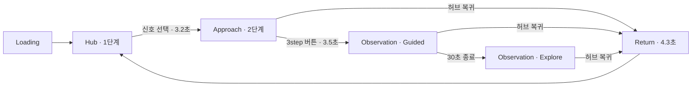

# 현재 구현 구조 및 수정 요청 용어 가이드

기준일: 2026-08-15

## 1. 문서 목적

현재 프로젝트는 **3단계 상태 머신 + 신호별 카메라 포커스 + `signal-05` 전용 2.5D 포털**까지 동작하는 인터랙티브 프로토타입이다.

이 문서는 다음 목적을 가진다.

- 현재 설계와 구현 수준을 한곳에서 확인한다.
- 단계, 전환, 카메라, 3D 레이어, 2.5D 레이어의 용어를 통일한다.
- 서로 다른 시간축을 명확하게 구분한다.
- 수정 요청 시 정확한 대상과 유지 조건을 지정할 수 있게 한다.
- 현재 완성된 부분과 하드코딩 또는 부분 구현된 부분을 구분한다.

콘텐츠 파일의 보관 위치와 교체 방법은 [`content_asset_hierarchy_and_workflow.md`](./content_asset_hierarchy_and_workflow.md)를 함께 참조한다.

## 2. 단계 및 전환 표준 용어

앞으로 `step`이라는 표현만 단독으로 사용하기보다 아래 표준 명칭을 함께 사용하는 것을 권장한다.

| 사용자 명칭 | 표준 명칭 | 코드 상태 | 의미 |
|---|---|---|---|
| 로딩 | Loading | `loading` | 초기 0.85초 준비 화면 |
| 1단계 | Hub | `hub` | 영상 배경, 5개 신호, 수동 오빗 |
| 1→2 전환 | Hub Entry Transition | `hubToApproach` | 선택 신호로 이동하는 3.2초 전환 |
| 2단계 | Approach | `approach` | 선택 신호 앞에서 내부가 58% 드러난 상태 |
| 3step 버튼 클릭 | Observation Entry Click | `enterObservation()` | 3단계 진입 타임라인 시작점 |
| 2→3 전환 | Observation Entry Transition | `approachToObservation` | 3.5초 카메라 전환 |
| 3단계 도착 | Observation Arrival | `observation + none` | 30초 카메라 돌리와 자동재생 시작 |
| 3단계 자동재생 | Guided Observation | `guided` | 자막 및 카메라 자동 연출 |
| 자동재생 종료 | Explore Mode | `explore` | 텍스트, 이미지 성격의 상세 정보, 영상 수동 탐색 |
| 허브 복귀 | Return Transition | `returnToHub` | 4.3초 연속 복귀 |



### 2.1 `3step 진입 시`의 세부 구분

`3step 진입 시`는 구현상 여러 지점을 의미할 수 있다. 앞으로 다음 용어로 구분한다.

- **Observation Entry Click**: 3step 버튼을 누른 바로 그 순간
- **Observation Entry Transition**: 버튼 클릭 후 3.5초 이동 구간
- **Observation Arrival**: 3.5초 이동이 끝난 순간
- **Guided Observation**: 도착 후 30초 자동재생 구간

## 3. 현재 시간축

현재 구현에는 세 개의 시간이 공존한다.

| 표준 시간축 | 시작점 | 현재 사용처 |
|---|---|---|
| Entry Clock `E` | 3step 버튼 클릭 | 블랙 암전, 자막 큐 |
| Observation Clock `O` | 3단계 도착 | 카메라 돌리, 2.5D 패럴랙스 |
| Sequence Clock `S` | 3단계 도착 | 진행 바, Guided → Explore 전환 |

Observation Arrival 이후에는 다음 관계가 성립한다.

```text
Entry Clock E = Observation Clock O + 3.5초
```

### 3.1 `signal-05` 실제 타임라인

| Entry Clock | Observation Clock | 현재 동작 |
|---:|---:|---|
| E 0초 | 진입 전 | 3step 클릭, 블랙 암전 시작 |
| E 2.73초 | 진입 전 | 2.5D 포털 페이드인 시작 |
| E 3.5초 | O 0초 | 3단계 도착, 포털 완전 노출, 암전 약 28% |
| E 5초 | O 1.5초 | 자동 패럴랙스 시작 |
| E 9.5초 | O 6초 | 패럴랙스 최대치 도달 |
| E 10초 | O 6.5초 | 주변 완전 블랙, 첫 자막 시작 |
| E 15.5초 | O 12초 | 두 번째 자막 시작 |
| E 21초 | O 17.5초 | 세 번째 자막 시작 |
| E 26.2초 | O 22.7초 | 네 번째 자막 시작 |
| E 33.5초 | O 30초 | 카메라 돌리 종료, Explore Mode 진입 |

시간이 포함된 요청은 다음처럼 작성한다.

```text
Entry Clock E 0~10초 동안 Black Matte를 opacity 0→1로 진행한다.
```

```text
Observation Clock O 0~30초 동안 카메라가 원경에서 근경으로 이동한다.
```

## 4. 뎁스 용어 구분

프로젝트에서 `뎁스`는 여러 의미로 사용될 수 있으므로 다음과 같이 구분한다.

| 용어 | 의미 |
|---|---|
| 구조 뎁스 | 앱 → 씬 → 오브젝트의 계층 |
| 월드 뎁스 | 실제 3D 좌표와 카메라 사이 거리 |
| 렌더 뎁스 | 어떤 레이어를 먼저 또는 나중에 그리는지 |
| 이미지 뎁스 | Depth Map으로 만든 사진 내부의 굴곡 |
| 체감 뎁스 | 카메라 이동, FOV, 패럴랙스로 느끼는 거리감 |

## 5. 전체 합성 레이어

### 5.1 DOM 합성 레이어

| 순서 | 레이어 | 현재 역할 |
|---:|---|---|
| Z0 | Hub Video | `hub-background.mp4` |
| Z1 | WebGL Canvas | 집, 오브젝트, 2.5D 포털 |
| Z3 | Interface | 자막, 진행 바, 허브 복귀 버튼 |
| Z4 | Scanlines / Noise | 화면 전체 질감 |
| Z9 | Loader | 초기 로딩 화면 |

블랙 매트는 WebGL Canvas 안에 있기 때문에 다음 요소는 블랙 위에 계속 표시된다.

- 자막
- 진행 바
- 허브 복귀 버튼
- Drei `Html`로 만들어진 신호 번호
- CSS Scanlines / Noise

따라서 완전히 아무것도 없는 블랙 화면을 요청하려면 `Black Matte`뿐 아니라 `Signal HUD`, `Scanlines`, `Noise`, `Interface`의 표시 여부도 별도로 지정해야 한다.

### 5.2 WebGL 씬 구조

```text
World
├─ Environment
│  ├─ Fog
│  ├─ Ambient / Directional / Point Lights
│  └─ Particle Points
└─ House Root
   ├─ Procedural Interior
   │  ├─ Room shell
   │  ├─ Table + two chairs
   │  ├─ Smartphone stand
   │  ├─ Square column
   │  └─ Six wall frames
   ├─ Depth Portal
   │  ├─ Black Matte
   │  ├─ Base Depth Mesh
   │  ├─ Midground Card
   │  ├─ Foreground Card
   │  └─ Interaction Plane
   └─ Five Signal Markers
```

## 6. 집 내부와 신호 연결

| 신호 | 표준 대상명 | 현재 오브젝트 | 2.5D |
|---|---|---|---|
| `signal-01` | Table Zone | 테이블과 의자 2개 | 없음 |
| `signal-02` | Device Zone | 스마트폰 스탠드 | 없음 |
| `signal-03` | Column Zone | 사각 건물 기둥 | 없음 |
| `signal-04` | Left Frame Zone | 왼쪽 액자 3개 + `feed_projection_01.glb` | 없음 |
| `signal-05` | Portal Zone | 오른쪽 액자 3개 + 건설 공간 이미지 | 적용됨 |

집 내부 오브젝트는 외부 GLB 모델이 아니라 Three.js의 박스, 평면, 실린더 조합으로 절차형 모델링되어 있다.

## 7. 카메라 구조

### 7.1 Hub Camera

- 위치: `[4.8, 2.45, 6.4]`
- 타깃: `[0, 0.35, 0]`
- FOV: `38°`
- 드래그 오빗 가능
- 수직 각도 제한: `58°~98°`
- 드래그 종료 1.9초 후 자동 회전 재개

### 7.2 Hub → Approach

- 길이: 3.2초
- 선택 신호의 `anchor + normal × approachDistance`로 이동
- FOV 종료값: `33°`

### 7.3 Approach → Observation

- 길이: 3.5초
- Cubic Bézier 카메라 경로
- `signal-05`는 일반 카메라 종점이 아니라 `Far Observation Frame`으로 이동

### 7.4 `signal-05` Observation Dolly

| 속성 | 현재값 |
|---|---:|
| 원경 오프셋 | `[-0.35, 0.7, 6.2]` |
| 원경 FOV | `44°` |
| 근경 오프셋 | `[-0.08, 0.14, 1.52]` |
| 근경 FOV | `25.5°` |
| 이동 시간 | 30초 |
| 보간 | Smootherstep |

### 7.5 `이미지를 더 멀게`의 세부 구분

| 원하는 결과 | 변경 대상 |
|---|---|
| 화면에서 작게 보이게 | `Far Camera Offset` 또는 `Far FOV` |
| 이미지 자체를 공간 뒤로 이동 | `Portal World Position` |
| 이미지 평면 크기 변경 | `Portal Size` |
| 사진 내부 굴곡 강화 | `Depth Scale` |
| 시점 이동 반응 강화 | `Max Parallax` |

위 다섯 가지는 서로 다른 결과를 만든다.

## 8. 2.5D 포털 구조

### 8.1 Base Depth Mesh

- 세그먼트: `128 × 224`
- 크기: `1.15 × 2.035`
- Depth Map을 버텍스 셰이더에서 읽어 Z축으로 변형
- `depthScale`: `0.18`
- `depthGamma`: `1.05`
- `maxParallax`: `0.032`
- `edgeFade`: `0.018`

### 8.2 포털 렌더 레이어

| 렌더 순서 | 레이어 | 로컬 Z | 역할 |
|---:|---|---:|---|
| 5 | Black Matte | `-0.025` | 주변 암전 |
| 10 | Base Depth Mesh | `0` | 컬러 + Depth Map 본체 |
| 20 | Midground Card | `0.1` | 중경 분리 레이어 |
| 30 | Foreground Card | `0.22` | 전경 분리 레이어 |
| 40 | Interaction Plane | `0.29` | 터치 핫스폿 |

Black Matte는 `depthTest=false`, `fog=false`이므로 환경 안개에 물들지 않고 블랙으로 합성된다.

### 8.3 2.5D 에셋

```text
color.webp
depth.png
midground-color.webp
midground-mask.png
foreground-color.webp
foreground-mask.png
fallback.webp
```

현재 전체 런타임 포털 에셋은 약 800KB 수준이다.

### 8.4 패럴랙스

- Guided 중에는 작은 자동 호흡 이동
- Explore 중에는 포인터 위치에 반응
- `prefers-reduced-motion`에서는 비활성화
- 버텍스 텍스처를 지원하지 않으면 `fallback.webp` 평면 사용
- WebGL 컨텍스트 손실 또는 포털 로드 실패 시 fallback 상태 사용

## 9. 블랙 암전 구조

현재 블랙 암전의 표준 명칭은 **Portal Black Matte**이다.

- `signal-05`에서만 적용
- Entry Clock E 0초부터 시작
- Entry Clock E 10초에 100%
- Procedural Interior 조명과 재질도 같은 값으로 감소
- 포털 이미지는 Black Matte보다 나중에 렌더되어 계속 보임
- 복귀 시 전환 진행률에 따라 역방향으로 해제

암전 관련 용어는 다음처럼 구분한다.

| 용어 | 의미 |
|---|---|
| Black Matte | 3D 배경을 검게 덮는 레이어 |
| Environment Darkness | 안개, 조명, 파티클 자체를 어둡게 만드는 것 |
| Interior Fade | 집 내부 오브젝트 투명도 감소 |
| UI Fade | 신호, 자막, 진행 바 등 DOM UI 감소 |
| Full Blackout | 포털을 포함해 화면 전체를 검게 덮는 것 |

현재 구현은 `Black Matte + Interior Fade`이며 `Full Blackout`은 아니다.

## 10. Guided와 Explore 콘텐츠

### 10.1 Guided Observation

- 기본 언어: 일본어
- `signal-05`: 하단 느린 자막
- `signal-01~04`: 우측 내레이션 패널
- 총 길이: 30초
- 진행 바 표시
- `signal-05`에서는 기존 글리치 효과 비활성화

### 10.2 Explore Mode

30초가 끝나면 다음 세 항목이 표시된다.

| ID | 표준 명칭 | 콘텐츠 |
|---|---|---|
| `trace-text` | Text Trace | 텍스트 |
| `trace-detail` | Detail Trace | 이미지 성격의 상세 설명. 현재 실제 이미지는 없음 |
| `trace-video` | Video Trace | `archive-signal.mp4` |

포털 위에도 같은 ID를 사용하는 세 개의 보이지 않는 핫스폿이 있다.

## 11. 현재 구현 성숙도

### 11.1 구현 완료 수준

- 3단계 상태 머신
- 5개 신호와 신호별 카메라 포커스
- Hub 수동 오빗과 자동 회전 복귀
- 절차형 집 내부 오브젝트
- `signal-04` Observation Entry 전용 GLB 모델
- `signal-05` 전용 2.5D Depth Shader
- 전경 및 중경 카드 패럴랙스
- 30초 카메라 돌리
- 10초 블랙 암전
- 일본어 자동 자막
- Guided → Explore 전환
- 텍스트, 상세, 영상 탐색 UI
- 허브 복귀 및 상태 초기화
- WebGL 폴백
- PWA 빌드와 로컬 에셋 프리캐시

### 11.2 부분 구현 또는 기술 부채

1. `signal-05`만 2.5D 포털을 사용한다.

2. `observations.json`에는 `observation-01` 한 개만 있고 모든 신호가 사실상 동일한 30초 길이를 공유한다.

3. JSON의 `events` 배열은 실제 재생 엔진에 연결되지 않았다. 현재 타이밍은 컴포넌트 코드와 상수에 직접 들어 있다.

4. Explore 항목도 JSON이 아니라 `ExploreInterface.tsx`에 다시 하드코딩되어 있다.

5. `isAudioEnabled` 상태는 있지만 실제 내레이션 또는 효과음 재생은 없다.

6. `observationDepth`, `cameraPresets.approach`, `cameraPresets.observation` 등 일부 초기 설계 값은 현재 경로에서 사용되지 않는다.

7. 전환, 카메라, 자동재생이 하나의 공통 시계가 아니라 각각 관리된다. 현재는 수동 오프셋으로 동기화되어 있다.

8. 신호 버튼은 Drei `Html` 요소이므로 WebGL Black Matte보다 위에 남는다. 완전한 몰입 화면을 원하면 별도 숨김 규칙이 필요하다.

9. 자동화된 모바일 브라우저 및 실기기 테스트 스위트는 저장소에 없다.

## 12. 수정 요청 표준 형식

다음 순서로 요청하면 가장 정확하게 수정 범위를 지정할 수 있다.

```text
[단계/전환]
[신호]
[대상 레이어 또는 대상 오브젝트]
[시간 기준]
[현재 문제]
[원하는 시작값 → 종료값]
[반드시 유지할 요소]
[검증 기준]
```

### 12.1 암전 수정 요청 예시

```text
Observation Entry Transition
signal-05
Portal Black Matte
Entry Clock E 0~8초
현재 10초 암전을 8초로 단축
opacity 0→1, smootherstep 유지
포털 이미지, 자막, 신호 UI는 유지
E 8초에 화면 모서리가 완전 블랙이어야 함
```

### 12.2 이미지 거리 수정 요청 예시

```text
Observation Arrival
signal-05
Far Camera Frame
Observation Clock O 0초
포털이 아직 크게 보임
포털 세로 점유율을 41%에서 32%로 축소
Portal Size와 Depth Scale은 유지
Far Observation Offset과 Far FOV만 변경
```

### 12.3 깊이감 수정 요청 예시

```text
Guided Observation
signal-05
Base Depth Mesh + Foreground Card
Observation Clock O 5~30초
사진 내부 굴곡이 약함
depthScale 0.18→0.24 검토
카메라 거리와 화면 점유율은 유지
전경 경계 찢어짐이 없어야 함
```

### 12.4 UI 제거 요청 예시

```text
Observation Entry Click부터 Explore 종료까지
signal-05
Signal HUD
모든 비선택 신호 번호 숨김
선택 신호 05도 E 3.5초에 숨김
자막과 허브 복귀 버튼은 유지
```

## 13. 주요 코드 위치

| 영역 | 파일 |
|---|---|
| 앱 합성 순서 | `src/app/App.tsx` |
| 전역 상태 머신 | `src/store/experienceStore.ts` |
| 카메라 및 전환 | `src/camera/CameraController.tsx` |
| Hub 오빗 | `src/interaction/HubOrbitController.tsx` |
| 신호 설정 | `src/signals/signalData.ts` |
| 신호 버튼 및 마커 | `src/signals/ObservationSignals.tsx` |
| 절차형 실내 | `src/scene/ObservationLayer.tsx` |
| 포털 설정 | `src/scene/depth-portal/depthPortalConfig.ts` |
| 포털 노출 및 암전 곡선 | `src/scene/depth-portal/depthPortalProgress.ts` |
| 포털 합성 | `src/scene/depth-portal/DepthPortalLayer.tsx` |
| Depth Shader 재질 | `src/scene/depth-portal/DepthPortalMaterial.ts` |
| 전경 및 중경 카드 | `src/scene/depth-portal/DepthPortalCards.tsx` |
| 터치 핫스폿 | `src/scene/depth-portal/DepthPortalHotspots.tsx` |
| 타이밍 상수 | `src/sequence/observationTiming.ts` |
| Guided 자동재생 | `src/sequence/SequenceController.tsx` |
| 자막 | `src/ui/ObservationSubtitles.tsx` |
| Explore UI | `src/ui/ExploreInterface.tsx` |
| 전체 UI 표시 규칙 | `src/ui/Interface.tsx` |

## 14. 권장되는 다음 구조 개선

향후 수정 요청을 더 안전하게 반영하려면 다음 세 가지를 우선 권장한다.

### 14.1 공통 타임라인 도입

`Entry Clock`, `Observation Clock`, `Sequence Clock`을 하나의 `ObservationTimeline`으로 통합한다.

### 14.2 신호별 Observation Definition 도입

각 신호를 다음과 같은 하나의 정의로 구성한다.

```ts
interface ObservationDefinition {
  signalId: SignalId
  focusTarget: FocusTargetDefinition
  camera: ObservationCameraDefinition
  portal?: DepthPortalDefinition
  timeline: ObservationTimelineDefinition
  subtitles: SubtitleCue[]
  exploreItems: ExploreItemDefinition[]
}
```

### 14.3 하드코딩 제거

현재 코드에 나뉘어 있는 다음 항목을 신호별 설정 파일로 이동한다.

- 콘텐츠
- 자막 큐
- 타임라인 이벤트
- 카메라 값
- 포털 값
- Explore 항목
- 터치 핫스폿

이 구조가 적용되면 이후에는 다음처럼 작은 단위로 수정할 수 있다.

```text
signal-05 / Entry Clock E 10초 / 첫 번째 자막 텍스트만 변경
```

```text
signal-05 / Observation Clock O 0초 / Far Camera Frame만 변경
```

```text
signal-02 / Explore Mode / Video Trace만 추가
```
